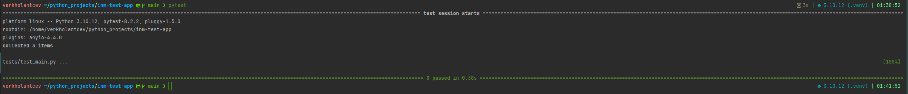

# inm-test-app
Test FastAPI app for inm   
Python - 3.10.12   
FastAPI - 0.111.0   
Pydantic - 2.8.2   

## Краткое опсиание

Простой сервис по CRU операциям, с использованим FastAPI.  
Данные хранятся в JSON файле.    
Файл генерируется в автоматическом режиме при старте приложения   

При старте, в `main.py` инициализируется пустой json файл `data/users.json`
```python
@asynccontextmanager
async def lifespan(app: FastAPI):
    """Эта функция будет выполнена при запуске приложения.
    Для инициализации пустого json файла, как хранилища пользователей
    """
    base_dir = os.path.dirname(os.path.abspath(__file__))
    file_path = os.path.join(base_dir, "..", "data", "users.json")
    with open(file_path, 'w') as f:
        json.dump([], f)
    yield
    os.remove(file_path)
```

## Зависимости

Все зависимости в requirements.txt
```pip install -r requirements.txt```

## Проблемы

Так как хранение реализовано в JSON файле, то при каждой операции CRUD Выгружается весь файл и заново записывается
каждый раз при каждой операции.  
Способ решения не придумал

## Краткое описание структуры

```
inm-app/
├── app/                               #Базовый функционал (ядро)
│   ├── __init__.py          
│   ├── crud_service/                  # Обработка логики операций CRUD 
│   │   ├── __init__.py
│   │   ├── json_data_helper           # Класс для работы с JSON
│   │   └── user_servie                # Логика CRUD, формирование исключений
│   ├── model/                         # Модель данных
│   │   ├── __init__.py
│   │   ├── user_model.py              # Модель пользователя 
│   ├── routers/                       # Маршрутизация и вызов контроллеров 
│   │   ├── __init__.py
│   │   └── users_router.py            # Маршрутизация запросов на /users/
│   └── main.py                        # Точка входа, создание приложения FastAPI 
├── data/
|   └── users_router.py                # Создается при запуске (Имитация БД)
├── tests/                             # Тесты
│   ├── __init__.py
|   └── users_router.py                # Тесты методов
└── requirements.txt                   # Зависимости проекта
```

## Тесты



# Методы

### 1 - GET `/users/`

```shell
curl -X 'GET' \
  'http://localhost:8000/users/' \
  -H 'accept: application/json'
```

Пользователи не найдены  
CODE - 200

```json
{
  "message:": "Пользователей не обнаружено"
}
```

Пользователи найдены  
CODE -200

```json
[
  {
    "name": "string",
    "email": "user@example.com",
    "created_at": "string",
    "updated_at": "string"
  }
]
```

---

### 2 - POST `/users/`

request body - `application/json`

```shell
curl -X 'POST' \
  'http://localhost:8000/users/' \
  -H 'accept: application/json' \
  -H 'Content-Type: application/json' \
  -d '{
  "name": "User1",
  "email": "user1@example.com"
}'
```

Успешно создан пользователь  
CODE - 201

```json
{
  "name": "User1",
  "email": "user1@example.com",
  "created_at": "2024-07-12 02:04:41",
  "updated_at": null
}
```

Пользователь с таким именем уже существует
CODE - 400

```json
{
  "detail": "Пользователь с таким именем уже существует"
}
```

Пользователь с таким email уже существует
CODE - 400

```json
{
  "detail": "Пользователь с таким email уже существует"
}
```

Не валидная почта   
CODE - 422

```json
{
  "detail": [
    {
      "type": "value_error",
      "loc": [
        "body",
        "email"
      ],
      "msg": "value is not a valid email address: An email address must have an @-sign.",
      "input": "example.com",
      "ctx": {
        "reason": "An email address must have an @-sign."
      }
    }
  ]
}
```

---

### 3 - PUT `/users/{user_name}/`

path var - 'str' user_name   
request body - `application/json`

```shell
curl -X 'PUT' \
  'http://localhost:8000/users/User5/' \
  -H 'accept: application/json' \
  -H 'Content-Type: application/json' \
  -d '{
  "email": "new_email@example.com"
}'
```

Пользователь успешно обновлен   
CODE - 200

```json
{
  "name": "User5",
  "email": "new_email@example.com",
  "created_at": "2024-07-12 02:11:21",
  "updated_at": "2024-07-12 02:11:49"
}
```

Пользователь не найден    
CODE - 400

```json
{
  "detail": "Пользователь не найден"
}
```

Пользователь с таким email уже существует   
CODE - 400

```json
{
  "detail": "Пользователь с таким email уже существует"
}
```

Не валидная почта   
CODE - 422

```json
{
  "detail": [
    {
      "type": "value_error",
      "loc": [
        "body",
        "email"
      ],
      "msg": "value is not a valid email address: An email address must have an @-sign.",
      "input": "example.com",
      "ctx": {
        "reason": "An email address must have an @-sign."
      }
    }
  ]
}
```

